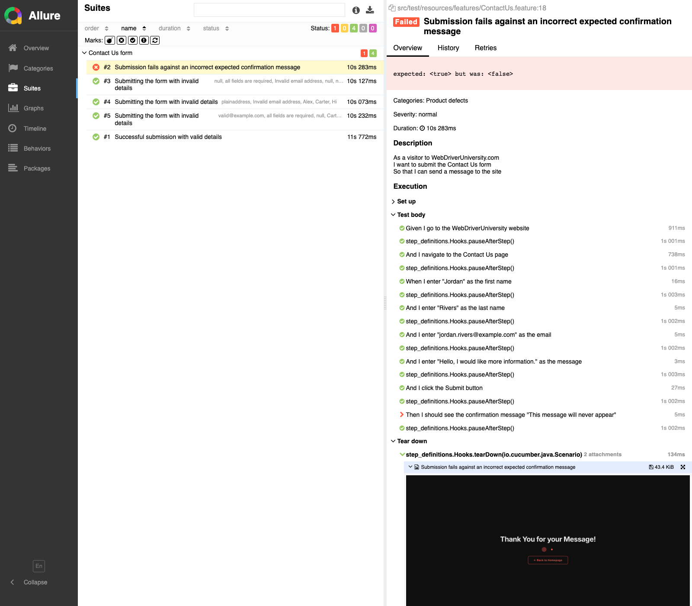

# Playwright Automation


## Overview

This repository contains an automated end-to-end test suite built with Playwright and Cucumber, executed via a TestNG runner. The framework is designed around configurability, maintainability, and clear, evidence-backed reporting.

Key capabilities:

- **Cross-browser execution** — Chromium and Firefox, selectable at runtime.
- **Externalized configuration** — browser, base URL, headless mode, and timing are driven entirely from a properties file and may be overridden via JVM system properties.
- **Dependency injection** — step definition and hook classes are wired together via Cucumber's PicoContainer integration, avoiding static shared state between scenarios.
- **Allure reporting** — every scenario is reported with a full step timeline; failed scenarios automatically capture and attach a screenshot of the application state at the point of failure.
- **Randomized test data** — the successful-submission scenario uses [Datafaker](https://www.datafaker.net/) to generate random names, emails, and messages at runtime, rather than relying on hardcoded values.

## Configuration

All environment values are defined in `src/test/resources/config/config.properties`:

| Key             | Description                            |
|-----------------|-----------------------------------------|
| `browser`       | Target browser (`chromium` or `firefox`) |
| `base.url`      | Base URL of the application under test  |
| `headless`      | Whether to run headless (`true`/`false`) |
| `step.delay.ms` | Pause applied after each Gherkin step   |

Any key may be overridden at runtime via a JVM system property without modifying the properties file, for example:

```bash
java -Dbrowser=firefox -cp "$CP" org.testng.TestNG -testclass runner.ContactUsRunner
```

## Running the Suite

```bash
mvn dependency:build-classpath -Dmdep.outputFile=/tmp/cp.txt -q
CP=$(cat /tmp/cp.txt):target/classes:target/test-classes
java -cp "$CP" org.testng.TestNG -testclass runner.ContactUsRunner
```

## Reporting

Generate and view the Allure report:

```bash
mvn io.qameta.allure:allure-maven:2.12.0:serve
```

When a scenario fails, a screenshot of the current page state is automatically captured and attached to that scenario's entry in the report (see `Hooks.java`), providing immediate visual context for the failure without needing to re-run the test.

### Sample Report — Failed Scenario



## License

This project is licensed under the [MIT License](LICENSE).
